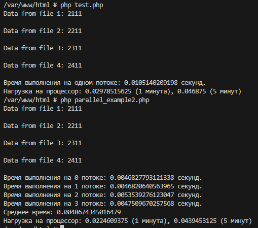

# Практика. Системы массового обслуживания. Многопоточность

## Инструкция по запуску:
1. В локальной директории из терминала выполняем команду: 

    `git clone https://github.com/vladislavpetrov4311/aboutphp -b parallel_php`
2. Переходим в папку с репозиторием aboutphp и из терминала запускаем: 

    1. `docker build . -t for_test_image`
    
    2. `docker run -it -d -v .:/var/www/html {id your image}`

## Пример работы
  

